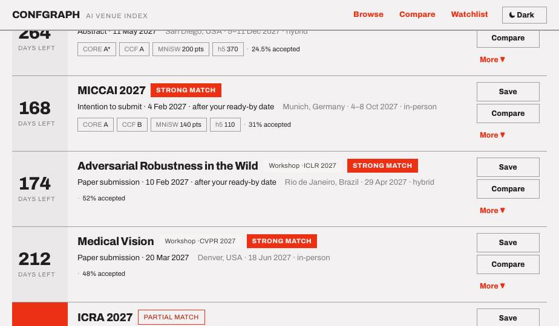

# Confgraph

A search interface for scientific conferences and workshops, aimed at one question:
*where should I submit this paper?*

State your paper's topics, target tier and ready-by date once; every venue is then ranked
and annotated against that profile. Secondary jobs: tracking deadlines you care about,
comparing shortlisted venues, and recording how your submissions to each are going.



## Run it

```bash
npm install
npm run dev          # http://localhost:5173
```

The JSON under `data/` is fetched at runtime, so the page must be served over HTTP —
opening `index.html` off the filesystem trips the browser's local-file restriction.

| Script | What it does |
| --- | --- |
| `npm run dev` | Dev server |
| `npm run validate` | The `DATA_GUIDE.md` "before committing" checks, as code |
| `npm test` | Parser and match-band regressions (100 tests) |
| `npm run typecheck` | `tsc --noEmit` |
| `npm run build` | Validates, typechecks, builds to `dist/` |
| `npm run build:venues` | Re-runs the repair/quarantine pipeline over the raw research dump |

`npm run build` runs `npm run validate` first, so a record that breaks the data rules fails
the build rather than shipping.

## Layout

```
data/                   the content contract — hand-edited, the source of truth
  venues.json           42 shipping venue records
  venues.pending.json   17 quarantined records, each with its _quarantine reason
  venue.schema.json     authoritative field list (see docs/SCHEMA_CHANGES.md)
  taxonomy.json         controlled vocabularies
  query-lexicon.json    trigger words for the plain-language bar
  venues.example.json   two filled records; reference only, never loaded

src/lib/                the domain layer, framework-free and unit-tested
  matching.ts           match bands, countdown derivation, the four sorts
  parser.ts             the plain-language bar
  filtering.ts          chip filters
  data.ts               loading + the load-time integrity checks
  urlState.ts           hash <-> state
src/views/              Browse · Detail · Compare · Watchlist
_ds/modernist-*/        the Modernist design system — every colour and space comes from here
scripts/                validate.mjs, build-venues.mjs
docs/                   DEPLOYMENT.md, SCHEMA_CHANGES.md, the original design prototype
```

## How it works

**Two tiers, deliberately.** The venue graph is public, changes rarely, and ships as static
JSON built from this repo — no live queries, no database, cacheable forever. User data
(watchlist, paper progress, paper profile) lives in browser storage under the `cg.*` keys
and is the only part that would ever need a backend. See [docs/DEPLOYMENT.md](docs/DEPLOYMENT.md)
for what that buys you: the whole read path runs free.

**Match bands are the ranking signal.** Your paper's topics are expanded through
`taxonomy.json#/narrowTopics` — so a paper tagged `fairness` reaches a venue tagged
`trustworthy AI` — then intersected with the venue's topics. Two or more overlaps is
*strong*, one is *partial*, none is *weak*, except a `broadScope` venue which floors at
*partial*. Fit sort orders by band, then overlap count, then target tier, then CORE tier,
then deadline proximity.

**The countdown is derived, never stored.** The app takes the first deadline still in the
future. A chain that has entirely passed reads as "cycle closed" with no extra flag; a venue
that published no dates reads as "no dates published". Those are different states and the UI
says which.

**The parser is honest about what it read.** `src/lib/parser.ts` is substring rules over
`data/query-lexicon.json`, with a visible "READ AS" trace naming every filter it set and a
note listing what it ignored. Every chip it sets stays hand-editable. When a model replaces
it, keep both — and keep the lexicon as the regression fixture, which is exactly what
`src/lib/__tests__/parser.test.ts` uses it as: the suite walks the lexicon rather than
hard-coding cases, so adding a phrasing extends the net with no test change.

**Nothing is shown that is not in the data.** Every venue carries `source.verifiedOn` and at
least one URL; `provisional` and `projected` dates are labelled as such in the results.
Integrity flags default to `null` and require citable evidence. Absence of a flag is not an
endorsement, and the interface never implies it is.

## Adding venues

Read [`DATA_GUIDE.md`](DATA_GUIDE.md) first, then `data/venue.schema.json`. The rules that
matter most:

- **One record per venue per year.** `ICLR 2027` and `ICLR 2028` are two records.
- **Ids are permanent.** Watchlists and paper progress are keyed on them in browser storage;
  renaming one orphans a user's tracked work.
- **Never overwrite an extended deadline** — original in `date`, extension in `extendedTo`.
- **Three to six broad topics.** Over-tagging destroys the match signal. If a venue really
  does accept most of ML, set `broadScope: true` instead.
- **No unsourced records.** `verifiedOn` plus at least one URL, or it does not ship.

Then `npm run validate`.

## Data status

42 of the 59 researched records ship. 17 are quarantined in `data/venues.pending.json`,
each with its reason — 13 for having no source URL, 2 journal special issues the venue model
has no slot for, 1 summer school with no submission deadline, and 1 workshop whose host
conference is not in the index. See [docs/SCHEMA_CHANGES.md](docs/SCHEMA_CHANGES.md) for the
three schema amendments this required and why.

## Design

Modernist: zero corner radius, 2px rules, flush-left labels, Archivo, a single red accent.
Every colour, space and font comes from `var(--*)` in the design system stylesheet — no
hex is hard-coded in the app. Dark mode is a `data-theme="dark"` attribute with the ramps
inverted in step. The rounded-corner variant is the one sanctioned deviation, behind the
header toggle while the choice is open; when it settles, delete the loser.

[`HANDOFF.md`](HANDOFF.md) is the full design spec and `docs/Confgraph.dc.html` is the
original prototype it describes.
